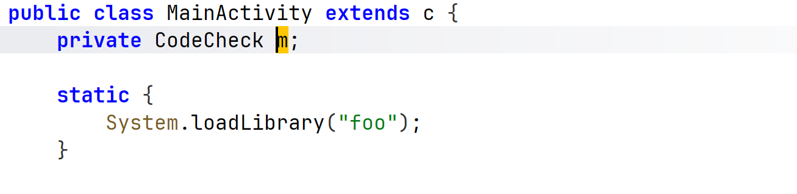
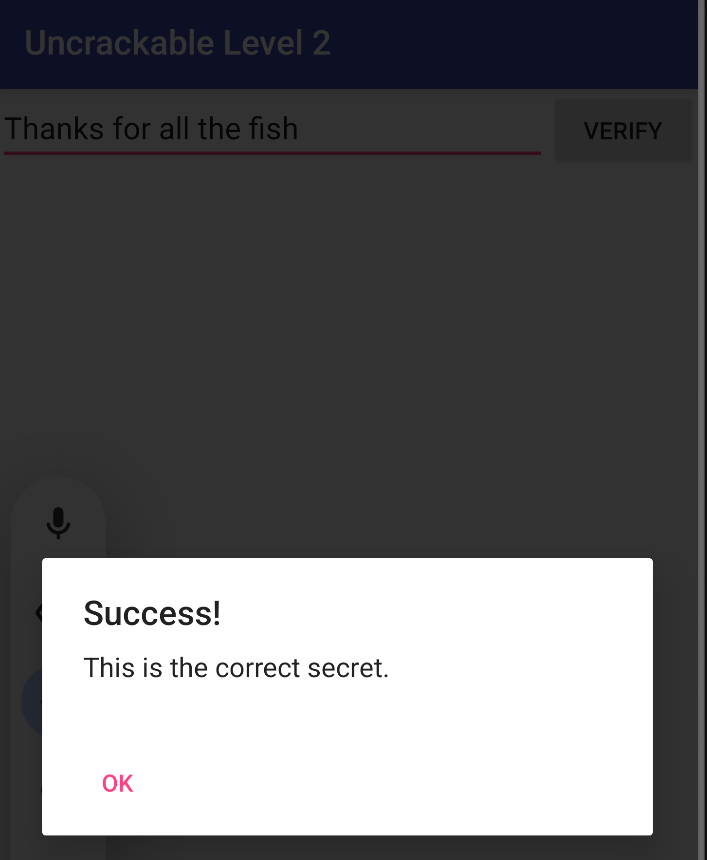

# Write-up: OWASP UnCrackable Level 2 (lab5)

## Introduction
Ce challenge consiste à extraire un secret dissimulé dans l'application `UnCrackable-Level2.apk`. Contrairement au niveau précédent, la logique de validation est implémentée en code natif via JNI (Java Native Interface).

## 1. Manifest
L'analyse du manifeste confirme le point d'entrée de l'application :
- **Package :** `owasp.mstg.uncrackable2`
- **Main Activity :** `sg.vantagepoint.uncrackable2.MainActivity`


Cette image présente le fichier de configuration principal de l'application Android.

Package : L'identifiant de l'application est owasp.mstg.uncrackable2.

Versions SDK : Elle cible l'API 28 (targetSdkVersion) avec un minimum requis à l'API 19.

Point d'entrée : La MainActivity est définie sous le nom de classe sg.vantagepoint.uncrackable2.MainActivity.

Filtre d'intention : Les balises <action android:name="android.intent.action.MAIN"/> et <category android:name="android.intent.category.LAUNCHER"/> confirment qu'il s'agit de l'écran qui s'affiche au lancement de l'application.

## 2. MainActivity


La méthode verify(View view) récupère l'entrée utilisateur depuis un EditText et la passe à this.m.a(string).

L'objet m est de type CodeCheck, où la méthode a est déclarée comme native.

Cette image montre le code Java de la méthode verify(View view), qui gère la logique de validation de l'utilisateur dans l'interface graphique.

Récupération de l'entrée : Le code récupère le texte saisi par l'utilisateur dans un champ de texte (R.id.edit_text).

Appel de logique : Il appelle this.m.a(string). Ici, m est une instance de la classe CodeCheck.

Feedback utilisateur : * Si m.a(string) renvoie true, une boîte de dialogue affiche "Success! This is the correct secret."

Sinon, elle affiche "Nope... That's not it."

## 3. libfoo.so
Dans le code décompilé par JADX, la classe `MainActivity` charge une bibliothèque native nommée **"foo"** :
```java
static {
    System.loadLibrary("foo");
}
```



Cette image révèle comment l'application utilise du code compilé (C/C++).

Membre m : On voit la déclaration de private CodeCheck m;, l'objet utilisé pour valider le secret.

Bloc statique : L'instruction System.loadLibrary("foo"); est cruciale. Elle indique que l'application charge une bibliothèque native nommée libfoo.so. Cela signifie que la véritable vérification du secret ne se fait probablement pas en Java, mais dans du code natif pour rendre l'analyse plus difficile.
L'analyse de la bibliothèque libfoo.so avec IDA Pro révèle la fonction de vérification du secret.

Le pseudocode généré montre une étape clé :

Une variable v9 reçoit la chaîne de caractères : "Thanks for all the fish".

Une comparaison est effectuée à l'aide de strncmp entre l'entrée utilisateur et cette chaîne sur une longueur de 23 caractères (0x17u).


Cette image montre la décompilation en C (pseudocode) de la bibliothèque native effectuée avec IDA.

Variable v9 : Une chaîne de caractères de référence est copiée : "Thanks for all the fish".

Logique de comparaison : On observe l'utilisation de la fonction strncmp. Elle compare une variable v7 (qui contient probablement la saisie traitée) avec le contenu de v9.

Condition de succès : La comparaison porte sur 0x17u (23 en décimal) caractères, ce qui correspond exactement à la longueur de la phrase "Thanks for all the fish".

Résultat : Si la comparaison est valide et que d'autres conditions (comme la vérification du débogage via byte_400C) sont remplies, la fonction retourne true (1), validant ainsi le secret au niveau Java.

## 5. Résultat
Le secret identifié dans le binaire natif est : **Thanks for all the fish**.



### Validation
En saisissant cette chaîne dans l'interface de l'application :

L'application appelle la fonction native.

La comparaison strncmp renvoie 0 (succès).

La boîte de dialogue "Success! This is the correct secret." s'affiche.

## Conclusion
Le niveau 2 de UnCrackable démontre l'utilisation du code natif pour masquer la logique métier et compliquer l'analyse. L'utilisation d'outils comme IDA Pro ou Ghidra est indispensable pour comprendre le flux d'exécution au-delà de la couche Java.
